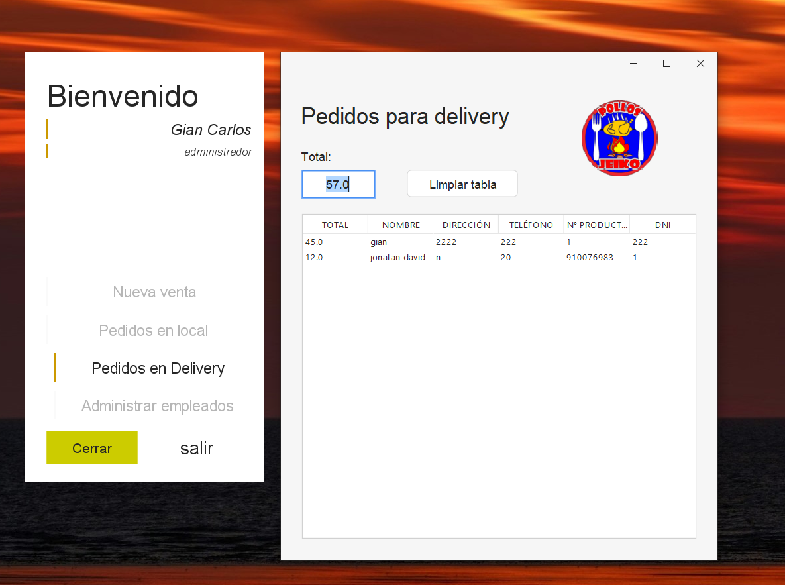

# Sistema de Gestión Basico Inicial en Java

Este es un proyecto inicial desarrollado en Java que utiliza archivos de texto (txt) como base de datos. El proyecto implementa principios de Programación Orientada a Objetos (POO) y cuenta con un sistema de autenticación y menús diferenciados para cada tipo de usuario.

### Características

- **Programación Orientada a Objetos (POO):** El sistema está diseñado utilizando clases y objetos para garantizar modularidad y escalabilidad.

- **Autenticación de Usuarios:** Los usuarios pueden iniciar sesión con credenciales almacenadas en un archivo de texto.

- **Menús Personalizados:** Cada tipo de usuario tiene acceso a opciones específicas en función de su rol.

- **Base de Datos Local:** La información se almacena en archivos de texto, eliminando la necesidad de una base de datos compleja.

## Estructura del Proyecto

```proyecto-java
|-- src
|   |-- Main.java
|   |-- Usuario.java
|   |-- Administrador.java
|   |-- Cliente.java
|   |-- GestorArchivos.java
|-- data
|   |-- usuarios.txt
|-- README.md
```

### Requisitos del Sistema

- **Java Development Kit (JDK):** Version 8 o superior.

- **Entorno de Desarrollo Integrado (IDE):** Recomendado IntelliJ IDEA, Eclipse o NetBeans.

## Capturas de Pantalla

### 1. Pantalla de Inicio de Sesión


### 2. Menú Principal


### 3. Administrar Empleados


### 4. Crear un Nuevo Pedido


### 5. Pedido para Delivery


### 6. Pedido en el Local


